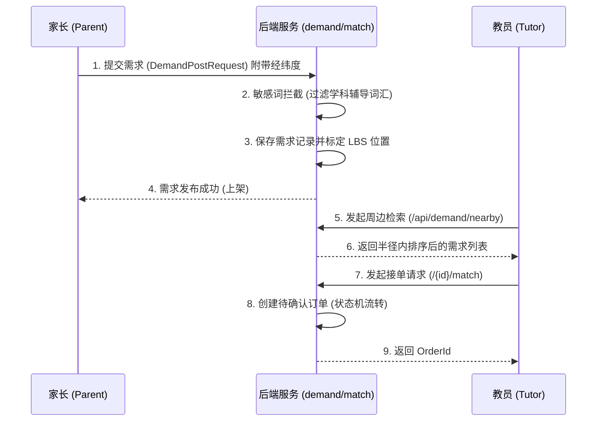
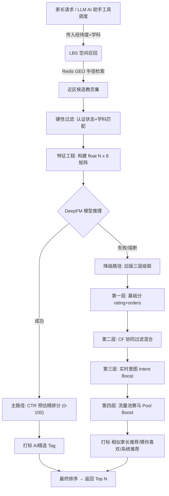

# CampusTutor (校园智教) - 项目全景指南 (ARCHITECTURE)

## 1. 项目基本信息

### 核心定位
**CampusTutor (校园智教)** 是一个专为家长和大学生打造的 O2O 家教匹配平台。平台的核心目标是消除传统家教中介信息不透明和高昂费用的痛点，通过**数字化认证、智能匹配算法（协同过滤+意图流）**以及**LBS定位**，构建一个“认证严、匹配准、服务全”的去中介化教育匹配生态。
> **⚠️ 业务合规说明**：平台已全面转型**素质教育**领域，在需求发布环节已硬性拦截并禁止任何学科类辅导（如数学、英语、物理等）的发布。

### 快速启动指南
环境依赖：JDK 17+, Node.js 18+, MySQL 8.0+, Redis 7.0+

1. **后端启动 (campus-backend)**
   - **DB准备**：创建 `campus_tutor_db` MySQL 数据库并导入 `initdatabase.sql`。
   - **配置修改**：修改 `src/main/resources/application.properties` 中的 DB 密码 (`spring.datasource.password`) 及 Redis 连接。
   - **运行**：在 IDE 中运行 `CampusApplication.java`。API文档访问地址：`http://localhost:8080/doc.html`。
2. **Web 前端启动 (campus-web / campus-web-admin)**
   - 进入目录：`cd campus-web` (家长/教员端) 或 `cd campus-web-admin` (管理端)。
   - 安装与运行：`npm install` -> `npm run dev`。
3. **小程序端启动 (campus-user-app)**
   - 将 `campus-user-app` 导入微信开发者工具。
   - 修改 `miniprogram/config/apiConfig.js` 中的 `BASE_URL`，编译运行。

---

## 2. 技术栈全景

本项目采用前后端分离架构，核心依赖及用途如下：

| 技术及框架 | 版本 | 在本项目中的具体用途 |
| :--- | :--- | :--- |
| **Spring Boot** | 3.2.1 | 后端核心微服务框架，提供自动化配置和 IoC/AOP 容器。 |
| **MyBatis-Plus** | 3.5.5 | 数据持久层框架，处理 MySQL 8.0 中的实体映射及 CRUD 操作。设置了统一的逻辑删除（`deleted=1`）规范。 |
| **MySQL** | 8.0 | 存储核心业务数据（如用户信息、教员资质、订单流水、需求记录等）。 |
| **Redis** | 7.0+ | 承担四大核心职责：1) 高速缓存；2) Session/Token 验证；3) **LBS 教员空间召回**（Redis GEO 存储教员经纬度，用于 DeepFM 主路径的半径检索）；4) **降级路径的数据流转**（Redis Stream `intent:actions` 追踪用户实时意图，存储 CF 算法缓存及教员流量池数据）。 |
| **JJWT** | 0.12.5 | 用于生成并验证无状态的 API 认证令牌（Bearer Token），负责身份鉴权。 |
| **Knife4j** | 4.4.0 | 基于 OpenAPI 3 的 Swagger 增强 UI，用于自动生成易读的后端接口文档。 |
| **Vue & Vite** | 3.4 / 5.1 | Web 端核心视图框架构建工具，使用 **Pinia** 2.x 做状态管理，**Element Plus** 2.5 构建后台和 PC 端 UI。 |
| **DeepSeek LLM** | API接入 | 后端配置了 DeepSeek 大模型（参数 `llm.provider=deepseek`），用于平台内的 AI 智能问答/聊天功能，内置 `recommend_nearby_tutors` 深度学习推荐工具供 Function Calling 调度。 |
| **ONNX Runtime** | 1.17.0 | 加载 Python 侧训练导出的 DeepFM 深度学习模型 (`campus_deepfm.onnx`)，完成教员与家长的特征预估精排。 |

---

## 3. 代码目录与模块职责

整个工作区分为四大系统端。以下为过滤了编译产物和临时文件后的核心架构树及职责说明：

```text
CampusTutor/
├── campus-backend/                 # [核心] 后端 Spring Boot 接口微服务
│   ├── src/main/java/com/campus/
│   │   ├── common/                 # 全局公共组件
│   │   │   ├── context/            # ThreadLocal 用户上下文封装 (UserContext)
│   │   │   ├── exception/          # 统一异常处理定义 (BusinessException, GlobalExceptionHandler)
│   │   │   ├── result/             # 统一响应包装体 (Result<T>)
│   │   │   └── utils/              # 通用工具类
│   │   ├── config/                 # 框架级别配置 (Swagger, WebMvc等)
│   │   └── module/                 # 垂直业务模块 (按特性分包 Package by Feature)
│   │       ├── auth/               # 认证模块 (登录、注册、JWT鉴权)
│   │       ├── demand/             # 需求模块 (素质教育需求发布、上下架、黑名单过滤)
│   │       ├── match/ & recommend/ # 推荐匹配模块 (DeepFM精排 → 降级:协同过滤+意图分+流量池)
│   │       ├── order/ & wallet/    # 订单与资金模块 (订单流转状态机、结算与流水)
│   │       ├── llm/ & chat/        # 智能对话模块 (大模型 API 交互及实时聊天)
│   │       └── ... (admin, ocr, map, parent, tutor, student)
│   └── src/main/resources/         # 属性配置 (application.properties)、MyBatis XML (mapper)
│
├── campus-web/                     # [用户侧] Web 消费者前端 (Vue 3)
│   └── src/ (views, stores, api)   # 包含家长找教员、教员接单的大型 Web 门户
│
├── campus-web-admin/               # [管理侧] Web 总控后台后台 (Vue 3)
│   └── src/views/                  # 包含审核模块、数据大屏、配置下发等运营职能
│
└── campus-user-app/                # [移动侧] 微信小程序原生前端
    └── miniprogram/ (pages, components) # 提供 LBS 地图接单、移动端认证等便捷入口
```

---

## 4. 核心业务流程分析

### 4.1 核心流程一：家长需求发布与教员 LBS 抢单
家长端发布素质教育需求（系统屏蔽学科词汇）；教员端通过 LBS 接口（距离半径）或算法接口寻源，最终发起接单匹配。



### 4.2 核心流程二：智能推荐双路径架构（DeepFM主路径 + 旧版降级路径）
平台采用 "主-备" 双路径级联推荐架构：主路径使用 LBS 空间召回 + DeepFM 深度学习精排；当 DeepFM 模型加载/推理失败时，系统自动降级至旧版「协同过滤 + 实时意图 + 流量池」推荐引擎，确保推荐服务的高可用性。



---

## 5. 开发规范总结

通过扫描后端源码（如 `DemandController.java`, `GlobalExceptionHandler.java` 等），总结出本项目已实施的以下开发规约：

1. **命名规约**
   - **类名及分层**：严格遵循 `Controller` -> `Service` (接口与实现 `ServiceImpl`) -> `Mapper` -> `Entity` 的层级命名。
   - **数据传输对象 (DTO)**：前后端交互的对象必须封装，请求入参一般命名为 `XxxRequest` (如 `DemandPostRequest`)，绝不直接对外暴露数据库 Entity 进行接收。
2. **RESTful API 风格**
   - 路径全小写并支持复数/资源概念定语（如 `/api/demand/publish`，`/api/demand/{id}/match`）。
   - 严格区分 HTTP Method：`@GetMapping` (查询)，`@PostMapping` (新建/执行动作)，`@PutMapping` (更新)，`@DeleteMapping` (删除)。
3. **统一异常处理与响应拆包机制**
   - 包含基于 `@RestControllerAdvice` 注入的 `GlobalExceptionHandler`，它能拦截系统级异常或自定义 `BusinessException`。
   - 所有的 API 响应强制约束为 `Result<T>` 泛型包装结构，包含 `code`, `msg`, `data`, `timestamp`四大字段。业务异常被捕获后优雅转化为带自定义 Code 和明文错误提示（不抛出 HTTP 500）。
   - 参数校验强依赖 JSR-380 (`@Valid`)，违反校验规则同样能在全局被捕获为格式化文本返回。
4. **部署与环境配置**
   - 遵循 `application.properties` 统一管理，抽离了 DB、Redis、微信支付密钥、LLM AI-Key 以及推荐系统的核心算法权重阈值（权重因子均开放为 properties 便于实施期调整）。
   - 项目根路径提供 `Dockerfile` 和 `docker-compose.yml`，符合容器化一键编排要求。
