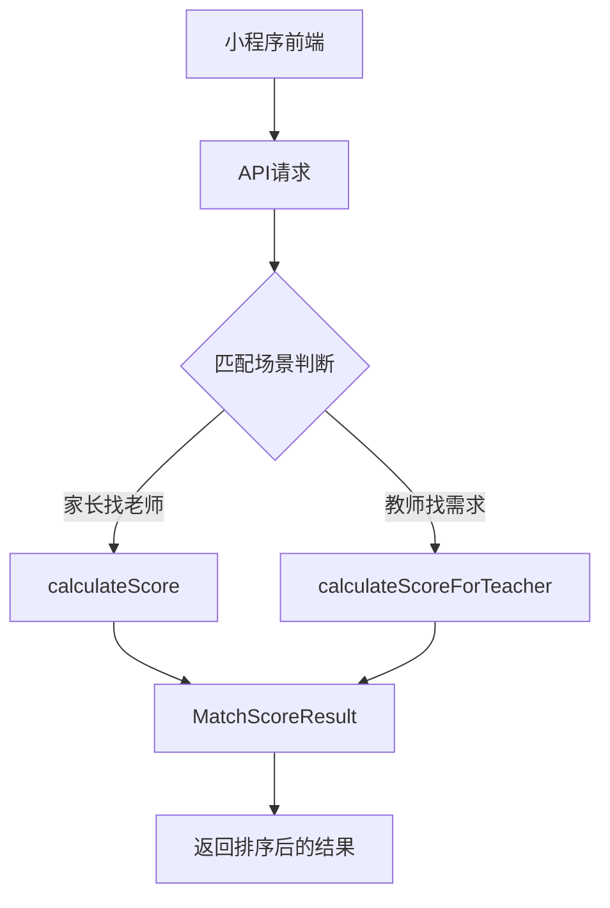

# 家教平台智能匹配算法文档

## 1. 算法概述

本项目采用**多维度加权评分算法**实现智能匹配，支持**双视角评分**：
- **家长视角**（找老师）：关注教师质量和性价比
- **教师视角**（找需求）：关注收益和匹配度

---

## 2. 系统架构



### 核心类结构

| 文件 | 作用 |
|:---|:---|
| [MatchScoreCalculator.java](file:///c:/Users/hao/Desktop/家教平台项目/CampusTutor/campus-backend/src/main/java/com/campus/module/match/service/MatchScoreCalculator.java) | 核心评分计算器 |
| [MatchScoreResult.java](file:///c:/Users/hao/Desktop/家教平台项目/CampusTutor/campus-backend/src/main/java/com/campus/module/match/dto/MatchScoreResult.java) | 评分结果DTO |
| [MatchViewType.java](file:///c:/Users/hao/Desktop/家教平台项目/CampusTutor/campus-backend/src/main/java/com/campus/module/match/dto/MatchViewType.java) | 视角类型枚举 |

---

## 3. 家长视角算法（找老师）

### 权重配置（总计100分）

| 维度 | 权重 | 说明 |
|:---|:---:|:---|
| 科目匹配 | 23% | 教师擅长科目是否包含需求科目 |
| 距离评分 | 18% | 教师与需求地点的距离（越近越好） |
| 年级匹配 | 14% | 教师可教年级是否包含需求年级 |
| 价格匹配 | 10% | **教师报价 ≤ 家长预算时高分** |
| 教师评分 | 10% | 历史评分（5分制） |
| 教学经验 | 10% | 完成订单数量 |
| 授课方式 | 5% | 上门/网课匹配 |
| 学历背景 | 5% | 学历等级 |
| 教学特长 | 5% | 教学风格匹配 |

### 价格评分公式（家长视角）

```
if 教师报价 ≤ 家长预算:
    得分 = 满分
elif 超出预算 < 50%:
    得分 = 满分 × (1 - 超出比例×2)
else:
    得分 = 0
```

> **核心逻辑**：教师报价越低，家长越满意

---

## 4. 教师视角算法（找需求）

### 权重配置（总计100分）

| 维度 | 权重 | 说明 |
|:---|:---:|:---|
| 科目匹配 | 25% | 是否是教师擅长科目 |
| **价格匹配** | **20%** | **需求预算越高越好** ⭐ |
| 年级匹配 | 15% | 是否是教师可教年级 |
| 距离评分 | 15% | 通勤成本 |
| 授课方式 | 10% | 符合教师能力 |
| **需求新鲜度** | **10%** | **新发布的需求更好** 🔥 |
| **需求详细度** | **5%** | **描述清晰更靠谱** |

### 价格评分公式（教师视角）

```
ratio = 需求预算 / 教师期望价

if ratio ≥ 1.5:
    得分 = 满分  // 高薪需求💰
elif ratio ≥ 1.0:
    得分 = 满分 × (0.8 + 0.2 × (ratio-1)/0.5)
elif ratio ≥ 0.8:
    得分 = 满分 × 0.6
else:
    得分 = 满分 × 0.3
```

> **核心逻辑**：需求预算越高，教师越感兴趣

### 新鲜度评分公式

```
发布天数 = 今天 - 发布日期

if 发布天数 ≤ 1:
    得分 = 满分  // 新发布🔥
elif 发布天数 ≤ 3:
    得分 = 满分 × 0.8
elif 发布天数 ≤ 7:
    得分 = 满分 × 0.6
elif 发布天数 ≤ 14:
    得分 = 满分 × 0.4
else:
    得分 = 满分 × 0.2
```

---

## 5. 通用评分维度详解

### 5.1 科目匹配

```java
// 教师擅长科目 JSON: ["数学", "物理"]
// 需求科目: "数学"
if 擅长科目.contains(需求科目):
    return 满分
else:
    return 0
```

### 5.2 年级匹配

```java
// 教师可教年级 JSON: ["初一", "初二", "初三"]
// 需求年级: "初二"
if 可教年级.contains(需求年级):
    return 满分
else:
    return 0
```

### 5.3 距离评分

```java
最大考虑距离 = 10km

if 距离 == null:
    return 满分 × 0.5  // 无位置信息
elif 距离 ≤ 0:
    return 满分
elif 距离 ≥ 10km:
    return 0
else:
    return 满分 × (1 - 距离/10)  // 线性递减
```

### 5.4 授课方式匹配

```java
// 需求要求: 1=上门, 2=网课, 3=均可
// 教师能力: canVisit(是否上门), canOnline(是否网课)

switch 需求要求:
    case 上门:
        return 教师支持上门 ? 满分 : 0
    case 网课:
        return 教师支持网课 ? 满分 : 0
    case 均可:
        return 教师支持任一 ? 满分 : 满分×0.5
```

---

## 6. 匹配标签系统

当某维度得分达到该维度满分的80%时，自动添加标签：

| 条件 | 标签 |
|:---|:---|
| 科目匹配度 ≥ 80% | ✅ 科目匹配 |
| 年级匹配度 ≥ 80% | ✅ 年级匹配 |
| 距离 ≤ 3km | ✅ 距离近 |
| 价格匹配度 ≥ 80%（教师视角） | 💰 高薪需求 |
| 发布天数 ≤ 3天 | 🔥 新发布 |
| 需求描述 ≥ 100字 | 📝 需求清晰 |
| 教师评分 ≥ 4.5 | ⭐ 高评分 |
| 订单数 ≥ 50 | 👨‍🏫 经验丰富 |

---

## 7. 匹配等级划分

| 总分范围 | 等级 | 前端显示 |
|:---|:---|:---|
| ≥ 90 | excellent | 🌟 极佳匹配 |
| 75-89 | good | 👍 优质匹配 |
| 60-74 | fair | 🙂 一般匹配 |
| < 60 | poor | 🤔 基础匹配 |

---

## 8. API调用流程

### 教师端获取需求列表

```
GET /api/demand/list-with-match
    ?subject=数学
    &page=1
    &size=10
    &sortBy=score
    &sortOrder=desc
```

**后端处理流程**：
1. 获取当前登录教师的档案 `TutorProfile`
2. 查询符合条件的需求列表 `DemandPost`
3. 对每个需求调用 `calculateScoreForTeacher()` 计算匹配度
4. 按匹配分数排序返回

### 家长端获取教师列表

```
GET /api/match/search
    ?subject=数学
    &grade=初二
    &longitude=116.31
    &latitude=39.99
```

**后端处理流程**：
1. 获取当前需求信息
2. 查询符合条件的教师列表 `TutorProfile`
3. 对每个教师调用 `calculateScore()` 计算匹配度
4. 按匹配分数排序返回

---

## 9. 前端展示

### 小程序页面

| 页面 | 路径 | 使用算法 |
|:---|:---|:---|
| 学生需求列表 | `/pages/teacher/findStudentList` | 教师视角 |
| 地图找学生 | `/pages/teacher/mapFindStudent` | 教师视角 |
| 需求详情 | `/pages/teacher/demandDetail` | 教师视角 |
| 教师搜索 | `/pages/parent/findTutor` | 家长视角 |

### 匹配度展示组件

```html
<!-- 匹配分数 -->
<view class="match-score">{{matchScore}}分</view>

<!-- 匹配标签 -->
<view class="match-tags">
  <text wx:for="{{matchTags}}" wx:key="*this">{{item}}</text>
</view>

<!-- 匹配等级 -->
<view class="match-level {{matchLevel}}">
  {{matchLevel === 'excellent' ? '极佳匹配' : 
    matchLevel === 'good' ? '优质匹配' : '一般匹配'}}
</view>
```

---

## 10. 算法优势

| 特点 | 说明 |
|:---|:---|
| **双视角设计** | 家长和教师看到的推荐结果符合各自利益 |
| **多维度评分** | 综合考虑科目、距离、价格等多个因素 |
| **可解释性强** | 标签系统让用户一眼看出推荐原因 |
| **权重可配置** | 权重常量集中管理，易于调优 |
| **性能友好** | O(n)时间复杂度，无额外存储开销 |

---

## 11. 后续优化方向

- [ ] 时间匹配：利用 `TutorScheduleConfig` 表匹配可用时间
- [ ] 行为学习：根据用户点击/联系行为调整权重
- [ ] 协同过滤：基于相似用户的选择进行推荐
- [ ] 热度衰减：需求新鲜度使用指数衰减而非阶梯式
