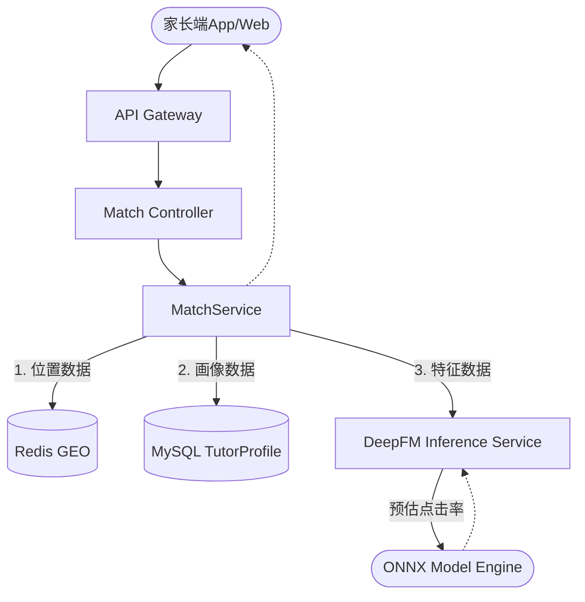
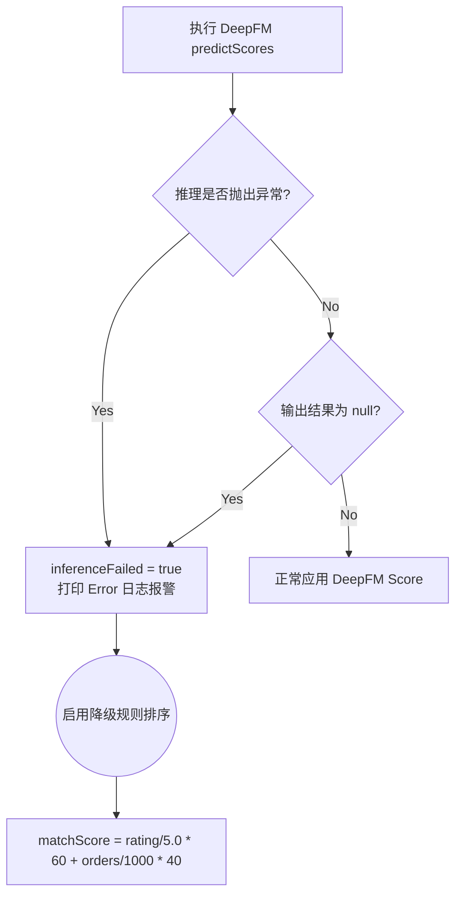

# CampusTutor 智能推荐算法架构设计文档

## 1. 架构总览

CampusTutor 智能推荐系统在原有按条件匹配的基础之上，引入了一套全新的**“LBS 召回 + DeepFM 深度学习精排”**级联系推荐架构。该架构旨在为家长提供个性化、高匹配度且距离合理的优秀教员推荐服务。

整体系统架构设计图（核心数据流向）：



## 2. 算法核心流程 (Cascade Recommendation)

新算法通过 `MatchService#getRecommendedTutors` 方法实现，共分为四个阶段（Phase）：

### 阶段一：LBS 空间召回 (Recall Phase)

由于全量教员数据过于庞大，且家教场景具有极强的地域属性（Location-Based Service），精排前必须进行第一层粗排/召回。

- **输入**：家长经度、纬度、搜索半径（Km）。
- **逻辑**：通过 `RedisTemplate.opsForGeo().radius()` 查询距离内的教员集合（Key: `geo:tutor`）。
- **限制**：如果 Redis 降级或周围无教员，快速返回空列表，避免无效计算。
- **关联过滤**：将召回的教员 ID 集合带入 MySQL（`tutor_profile` 表），只查询 `certStatus == 2`（已认证）的活跃档案。

### 阶段二：特征工程 (Feature Engineering)

将家长信息与召回的教员列表转化为 ONNX 模型所能理解的数值矩阵（`float[N][8]`）。特征提取遵循 `MatchService#buildFeatureVector` 方法：

| 特征名称 | 数据类型 | 业务含义 | 转换规则 / 规范化公式 |
| :--- | :--- | :--- | :--- |
| `user_id` | 离散 (ID) | 家长身份标识 | `hashCode() & 0x7FFFFFFF % 10000` |
| `tutor_id` | 离散 (ID) | 教员身份标识 | `hashCode() & 0x7FFFFFFF % 10000` |
| `university_name` | 离散 (Hash) | 教员毕业/就读院校 | `hashCode() & 0x7FFFFFFF % 10000` |
| `teach_subjects` | 离散 (Hash) | 教员可教授科目(JSON串) | `hashCode() & 0x7FFFFFFF % 10000` |
| `can_online` | 二值 (0/1) | 是否支持在线授课 | `0.0f` 或 `1.0f` |
| `expect_price` | 连续 (数值) | 教员期望时薪 | `expect_price / 500f` |
| `rating` | 连续 (数值) | 教员历史综合评分 | `rating / 5.0f` |
| `order_count` | 连续 (数值) | 教员历史接单总数 | `order_count / 1000f` |

### 阶段三：深度学习推理 (Ranking Phase)

本平台采用基于 Factorization Machine 和 Deep Neural Networks 结合的 **DeepFM** 模型结构。

- **框架**：使用 Microsoft 开源的高性能 `onnxruntime` 构建 Java 侧的推理引擎。
- **生命周期**：
  - [DeepFMInferenceService](file:///c:/Users/hao/Desktop/%E5%AE%B6%E6%95%99%E5%B9%B3%E5%8F%B0%E9%A1%B9%E7%9B%AE/CampusTutor/campus-backend/src/main/java/com/campus/module/match/service/DeepFMInferenceService.java#18-154) 在 Spring 容器 `@PostConstruct` 阶段一次性将 [campus_deepfm.onnx](file:///c:/Users/hao/Desktop/%E5%AE%B6%E6%95%99%E5%B9%B3%E5%8F%B0%E9%A1%B9%E7%9B%AE/CampusTutor/campus-backend/src/main/resources/campus_deepfm.onnx) 加载至内存（`OrtSession`）。
  - 推理时仅做 `OnnxTensor` 封装和内存拷贝，避免磁盘 I/O。
- **并发控制**：`OrtSession` 设置 `IntraOpNumThreads=2` 来限制单次推理的计算资源，防止瞬间高并发拖垮 CPU。
- **输出**：返回长度为 N 的 float 数组（每位教员被用户点击的预估概率 CTR）。

### 阶段四：排序与组装 (Scoring & Aggregation)

最后一步将模型输出翻译给用户界面使用：

1. **分值转换**：将 CTR 模型产生的 `0~1.0` 概率转化为 `0~100` 的 `matchScore`。
2. **标签打标 (Tags)**：
   - 对 `matchScore >= 80` (`scores[i] >= 0.8`) 的教员打上 `"AI精选"` 标签。
   - 对距离 `<= 2.0km` 的教员打上 `"距离近"` 标签。
3. **列表排序**：根据 `matchScore` 降序排列（`results.sort(...)`）。

## 3. 容灾与降级策略 (Graceful Degradation)

在推荐系统的工程化实践中，“可用性”高于“精确度”。为了防范模型文件丢失、ONNX Runtime 核心库异常崩溃、内存溢出等问题，我们在代码中实现了硬编码的**规则兜底降级策略**。



**降级后的 `matchScore` 计算公式：**
$$ \text{FallbackScore} = (\frac{\text{Rating}}{5.0} \times 60) + (\min(\frac{\text{OrderCount}}{1000}, 1.0) \times 40) $$

此公式确保即使 AI 引擎完全宕机，系统依然能将“评分高、经验多（接单多）”的优质老教员排在前面，不造成推荐列表乱序。

## 4. 依赖项管理

本模块强依赖以下包，已写入 [pom.xml](file:///c:/Users/hao/Desktop/%E5%AE%B6%E6%95%99%E5%B9%B3%E5%8F%B0%E9%A1%B9%E7%9B%AE/CampusTutor/campus-backend/pom.xml)：

```xml
<dependency>
    <groupId>com.microsoft.onnxruntime</groupId>
    <artifactId>onnxruntime</artifactId>
    <version>1.17.0</version>
</dependency>
```
*注：对于线上 Docker 部署，需要确保底层 Linux 包含 glibc 基础库（ONNX C++ core 依赖）。*
