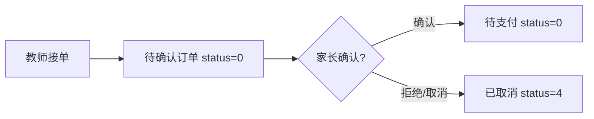
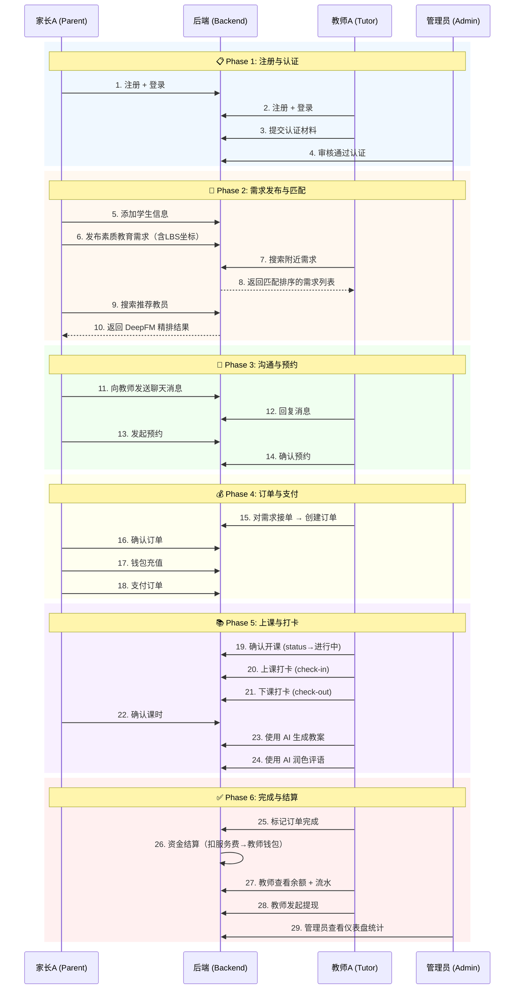

# CampusTutor 校园智教 — 完整业务测试流程

> **版本**: v1.0 · **日期**: 2026-04-14 · **适用范围**: campus-backend + campus-web-parents + campus-web-teacher + campus-web-admin

---

## 目录

1. [环境准备与启动](#1-环境准备与启动)
2. [测试角色与账号规划](#2-测试角色与账号规划)
3. [模块一：用户认证](#3-模块一用户认证)
4. [模块二：教师认证审核](#4-模块二教师认证审核)
5. [模块三：家长信息管理](#5-模块三家长信息管理)
6. [模块四：需求发布与管理](#6-模块四需求发布与管理)
7. [模块五：智能匹配与推荐](#7-模块五智能匹配与推荐)
8. [模块六：预约与接单](#8-模块六预约与接单)
9. [模块七：订单全生命周期](#9-模块七订单全生命周期)
10. [模块八：课时打卡管理](#10-模块八课时打卡管理)
11. [模块九：钱包与资金流](#11-模块九钱包与资金流)
12. [模块十：实时聊天](#12-模块十实时聊天)
13. [模块十一：AI 智能服务](#13-模块十一ai-智能服务)
14. [模块十二：管理后台](#14-模块十二管理后台)
15. [异常与边界场景](#15-异常与边界场景)
16. [端到端核心链路汇总](#16-端到端核心链路汇总)

---

## 1. 环境准备与启动

### 1.1 基础环境依赖

| 组件 | 最低版本 | 备注 |
|:---|:---|:---|
| JDK | 17+ | 后端 Spring Boot |
| Node.js | 18+ | 前端 Vite + Vue3 |
| MySQL | 8.0+ | 核心业务数据库 |
| Redis | 7.0+ | 缓存/GEO/Session |

### 1.2 启动步骤

```bash
# 1. 数据库初始化
mysql -u root -p -e "CREATE DATABASE campus_tutor_db;"
mysql -u root -p campus_tutor_db < sql/schema.sql

# 2. 后端启动
cd campus-backend
# 配置 .env 文件（DB密码、Redis、LLM API Key 等）
# IDE 运行 CampusApplication.java --spring.profiles.active=dev

# 3. 家长端
cd campus-web-parents && npm install && npm run dev

# 4. 教师端
cd campus-web-teacher && npm install && npm run dev

# 5. 管理后台
cd campus-web-admin && npm install && npm run dev
```

### 1.3 启动验证清单

- [ ] 后端 API 文档可访问：`http://localhost:8080/doc.html`
- [ ] MySQL 连接正常，表结构完整
- [ ] Redis 连接正常，GEO 命令可用
- [ ] 家长端页面加载正常
- [ ] 教师端页面加载正常
- [ ] 管理后台页面加载正常

---

## 2. 测试角色与账号规划

| 角色 | 建议手机号 | 密码 | 说明 |
|:---|:---|:---|:---|
| 家长 A | `13800000001` | `Test@123` | 主测试家长 |
| 家长 B | `13800000002` | `Test@123` | 辅助测试家长 |
| 教师 A | `13900000001` | `Test@123` | 主测试教师（通过认证） |
| 教师 B | `13900000002` | `Test@123` | 辅助测试教师（未认证） |
| 管理员 | `admin` | `admin123` | 后台管理员 |

---

## 3. 模块一：用户认证

### 3.1 用户注册

| # | 测试步骤 | API | 预期结果 |
|:---|:---|:---|:---|
| 1 | 发送注册验证码 | `POST /api/auth/send-code?phone=13800000001` | 返回成功，验证码已发送（Mock） |
| 2 | 输入验证码 + 密码注册 | `POST /api/auth/register` | 返回 `token` + 用户信息，状态 200 |
| 3 | 重复手机号注册 | `POST /api/auth/register` | ❌ 提示"手机号已注册" |
| 4 | 空手机号注册 | `POST /api/auth/register` | ❌ 参数校验失败 |

> [!TIP]
> 验证码为 Mock 模式，通常固定返回 `123456` 或查看控制台日志获取。

### 3.2 用户登录

| # | 测试步骤 | API | 预期结果 |
|:---|:---|:---|:---|
| 1 | 正确手机号 + 密码登录 | `POST /api/auth/login` | 返回 JWT Token |
| 2 | 错误密码登录 | `POST /api/auth/login` | ❌ 提示"密码错误" |
| 3 | 不存在的用户登录 | `POST /api/auth/login` | ❌ 提示"用户不存在" |

**✅ 验证点**：
- Token 格式为 Bearer JWT
- 后续请求 Header 携带 `Authorization: Bearer {token}` 可正常鉴权

### 3.3 密码找回

| # | 测试步骤 | API | 预期结果 |
|:---|:---|:---|:---|
| 1 | 向已注册手机号发送重置验证码 | `POST /api/auth/reset/send-code?phone=xxx` | ✅ 成功 |
| 2 | 向未注册手机号发送 | `POST /api/auth/reset/send-code?phone=xxx` | ❌ 用户不存在 (5001) |
| 3 | 输入正确验证码 + 新密码重置 | `POST /api/auth/reset/password` | ✅ 密码重置成功 |
| 4 | 使用新密码登录 | `POST /api/auth/login` | ✅ 登录成功 |

---

## 4. 模块二：教师认证审核

### 4.1 教师提交认证

> **前置**：以教师 A 身份登录教师端

| # | 测试步骤 | API | 预期结果 |
|:---|:---|:---|:---|
| 1 | 填写认证信息（学校、专业、学历证明等） | `POST /api/tutor/certification` | ✅ 提交成功 |
| 2 | 查询认证状态 | `GET /api/tutor/certification` | 状态为 `待审核` |
| 3 | 查询认证进度 | `GET /api/tutor/certification/progress` | 返回进度信息 |

### 4.2 管理员审核认证

> **前置**：以管理员身份登录管理后台

| # | 测试步骤 | API | 预期结果 |
|:---|:---|:---|:---|
| 1 | 查看待审核列表 | `GET /api/admin/tutors/pending` | 列出待审核教师，含教师 A |
| 2 | 查看教师详情 | `GET /api/admin/tutors/{id}` | 显示完整认证材料 |
| 3 | **通过认证** | `POST /api/admin/tutors/{id}/approve` | ✅ 认证通过 |
| 4 | **拒绝认证**（测试教师 B） | `POST /api/admin/tutors/{id}/reject` + reason | ✅ 已拒绝 |

### 4.3 认证后教师端验证

| # | 测试步骤 | API | 预期结果 |
|:---|:---|:---|:---|
| 1 | 教师 A 查询认证状态 | `GET /api/tutor/certification/status` | ✅ 已认证 |
| 2 | 教师 A 查看/更新档案 | `GET/PUT /api/tutor/profile` | ✅ 正常 |
| 3 | 教师 A 配置可用时间 | `POST /api/tutor/schedule` | ✅ 保存成功 |
| 4 | 教师 B 查询认证状态 | `GET /api/tutor/certification/status` | 状态：已拒绝 |

---

## 5. 模块三：家长信息管理

> **前置**：以家长 A 身份登录家长端

| # | 测试步骤 | API | 预期结果 |
|:---|:---|:---|:---|
| 1 | 添加学生信息（姓名、年级、学校等） | `POST /api/parent/student` | ✅ 返回 studentId |
| 2 | 查看学生列表 | `GET /api/parent/students` | ✅ 含刚添加的学生 |
| 3 | 更新学生信息 | `PUT /api/parent/student` | ✅ 修改成功 |
| 4 | 查看学生详情 | `GET /api/parent/student/{id}` | ✅ 数据准确 |
| 5 | 删除学生 | `DELETE /api/parent/student/{id}` | ✅ 已删除 |

---

## 6. 模块四：需求发布与管理

### 6.1 发布需求（正常流程）

> **前置**：家长 A 已登录

| # | 测试步骤 | API | 预期结果 |
|:---|:---|:---|:---|
| 1 | 填写素质教育需求（如"钢琴陪练"） | `POST /api/demand/publish` | ✅ 返回 demandId |
| 2 | 查看我的需求列表 | `GET /api/demand/my` | ✅ 列表包含新需求 |
| 3 | 查看需求详情 | `GET /api/demand/detail/{id}` | ✅ 数据一致 |

### 6.2 敏感词拦截（合规测试）

> [!IMPORTANT]
> 平台已全面转型素质教育，学科类需求必须被拦截。

| # | 测试内容 | 请求 body 示例 | 预期结果 |
|:---|:---|:---|:---|
| 1 | 标题含"数学" | `{"title": "数学辅导", ...}` | ❌ "请勿发布学科类辅导需求" |
| 2 | 科目含"英语" | `{"subject": "英语", ...}` | ❌ 拦截 |
| 3 | 详情含"补习" | `{"detail": "补习功课", ...}` | ❌ 拦截 |
| 4 | 标题含"奥数" | `{"title": "奥数竞赛", ...}` | ❌ 拦截 |
| 5 | 正常素质教育 | `{"title": "书法入门", ...}` | ✅ 发布成功 |

**黑名单词库**：`数学、语文、英语、物理、化学、生物、历史、地理、政治、提分、冲刺、补习、补课、奥数、作文辅导`

### 6.3 需求上下架管理

| # | 测试步骤 | API | 预期结果 |
|:---|:---|:---|:---|
| 1 | 下架需求 | `POST /api/demand/{id}/offline` | ✅ 状态变为 0（下架） |
| 2 | 教师端搜索该需求 | `GET /api/demand/list` | ✅ 不应出现已下架需求 |
| 3 | 重新上架 | `POST /api/demand/{id}/online` | ✅ 状态变为 1（上架） |
| 4 | 删除需求 | `DELETE /api/demand/{id}` | ✅ 逻辑删除 |

---

## 7. 模块五：智能匹配与推荐

### 7.1 LBS 附近需求搜索

> **前置**：教师 A 已认证，家长 A 已发布带经纬度的需求

| # | 测试步骤 | API | 预期结果 |
|:---|:---|:---|:---|
| 1 | 教师搜索附近需求 | `GET /api/demand/nearby?longitude=113.26&latitude=23.13&radius=10` | ✅ 返回半径内的需求 |
| 2 | 扩大搜索半径 | 改 `radius=50` | ✅ 结果增多 |
| 3 | 缩小到极小半径 | `radius=0.1` | ✅ 结果可能为空 |

### 7.2 教员智能推荐

> **前置**：家长 A 已登录

| # | 测试步骤 | API | 预期结果 |
|:---|:---|:---|:---|
| 1 | 按学科搜索教员 | `GET /api/match/tutors?subject=钢琴` | ✅ 返回匹配教员列表 |
| 2 | 带 LBS 的搜索 | `GET /api/match/tutors?subject=钢琴&longitude=113.26&latitude=23.13` | ✅ 按距离+匹配度排序 |
| 3 | 带匹配度的需求列表 | `GET /api/demand/list-with-match` | ✅ 每条需求附带匹配分 |

**✅ 验证点**：
- 主路径（DeepFM）时结果带 `AI精选` 标签
- 降级路径时结果带 `相似家长推荐` / `猜你喜欢` / `系统推荐` 标签
- 返回结果按 score 降序

### 7.3 推荐降级测试

| # | 测试方式 | 预期结果 |
|:---|:---|:---|
| 1 | 正常情况（DeepFM 模型可用） | 使用主路径精排 |
| 2 | 移除/重命名 `campus_deepfm.onnx` 模型文件 | 自动降级至旧版三层级联推荐 |
| 3 | 恢复模型文件 | 恢复主路径 |

---

## 8. 模块六：预约与接单

### 8.1 家长发起预约

| # | 测试步骤 | API | 预期结果 |
|:---|:---|:---|:---|
| 1 | 家长 A 向教师 A 发起预约 | `POST /api/booking/create` | ✅ 返回 bookingId |
| 2 | 家长查看预约列表 | `GET /api/booking/parent/list` | ✅ 含新预约 |

### 8.2 教师处理预约

| # | 测试步骤 | API | 预期结果 |
|:---|:---|:---|:---|
| 1 | 教师查看接收的预约 | `GET /api/booking/tutor/list` | ✅ 含来自家长 A 的预约 |
| 2 | 教师确认预约 | `POST /api/booking/confirm/{bookingId}` | ✅ 确认成功 |
| 3 | 教师拒绝另一个预约 | `POST /api/booking/reject/{bookingId}?reason=xxx` | ✅ 已拒绝 |

### 8.3 教师主动接单（需求匹配）

| # | 测试步骤 | API | 预期结果 |
|:---|:---|:---|:---|
| 1 | 教师对需求发起匹配/接单 | `POST /api/demand/{id}/match` | ✅ 返回 orderId |
| 2 | 也可通过订单接口接单 | `POST /api/order/accept` | ✅ 返回 orderId |

### 8.4 家长取消预约

| # | 测试步骤 | API | 预期结果 |
|:---|:---|:---|:---|
| 1 | 家长取消已发预约 | `POST /api/booking/cancel/{bookingId}` | ✅ 取消成功 |

---

## 9. 模块七：订单全生命周期

> [!IMPORTANT]
> 订单状态机：`0 待确认/待支付` → `1 已支付待上课` → `2 进行中` → `3 已完成` / `4 已取消` / `5 退款中` → `6 已退款`

### 9.1 订单创建与确认



| # | 测试步骤 | API | 预期结果 |
|:---|:---|:---|:---|
| 1 | 教师 A 对需求接单 | `POST /api/demand/{id}/match` | ✅ 创建订单，返回 orderId |
| 2 | 家长 A 查看订单列表 | `GET /api/order/parent/list` | ✅ 新订单在列（status=0） |
| 3 | 家长确认订单 | `POST /api/order/{id}/confirm` | ✅ 订单变为待支付 |
| 4 | 查看订单详情 | `GET /api/order/{id}` | ✅ 状态、金额、科目正确 |

### 9.2 订单支付

| # | 测试步骤 | API | 预期结果 |
|:---|:---|:---|:---|
| 1 | 家长钱包余额充足时支付 | `POST /api/order/pay` | ✅ status → 1（已支付待上课） |
| 2 | 余额不足时支付 | `POST /api/order/pay` | ❌ 余额不足提示 |
| 3 | 使用Mock充值后再支付 | 先 `POST /api/wallet/recharge` | ✅ 支付成功 |

### 9.3 开课与上课

| # | 测试步骤 | API | 预期结果 |
|:---|:---|:---|:---|
| 1 | 教师确认开课 | `POST /api/order/{id}/start` | ✅ status → 2（进行中） |
| 2 | 教师查看订单 | `GET /api/order/tutor/list?status=2` | ✅ 显示进行中的订单 |

### 9.4 订单完成

| # | 测试步骤 | API | 预期结果 |
|:---|:---|:---|:---|
| 1 | 教师标记完成 | `POST /api/order/{id}/complete` | ✅ status → 3（已完成） |
| 2 | 家长端显示已完成 | `GET /api/order/parent/list?status=3` | ✅ |

### 9.5 取消与退款

| # | 测试步骤 | API | 预期结果 |
|:---|:---|:---|:---|
| 1 | 待支付订单 - 家长取消 | `POST /api/order/{id}/cancel?reason=不需要了` | ✅ status → 4 |
| 2 | 已支付订单 - 申请退款 | `POST /api/order/refund?orderId=xx&refundAmount=xx&reason=xx` | ✅ 返回退款编号 |
| 3 | 管理员处理退款 | `POST /api/admin/orders/{id}/refund` | ✅ status → 6 |

### 9.6 权限验证

| # | 测试步骤 | 预期结果 |
|:---|:---|:---|
| 1 | 家长 B 查看家长 A 的订单 | ❌ 无权查看 (403) |
| 2 | 管理员查看任何订单 | ✅ 有权 |
| 3 | 教师 B 操作教师 A 的订单 | ❌ 无权操作 |

---

## 10. 模块八：课时打卡管理

### 10.1 教师打卡

| # | 测试步骤 | API | 预期结果 |
|:---|:---|:---|:---|
| 1 | 教师上课打卡 | `POST /api/teaching/check-in` (orderId等) | ✅ 返回 recordId |
| 2 | 教师下课打卡 | `POST /api/teaching/check-out/{recordId}` (含内容摘要) | ✅ 打卡成功 |
| 3 | 更新课时进度 | `POST /api/teaching/update-progress/{recordId}?progress=50` | ✅ 进度已更新 |

### 10.2 家长处理

| # | 测试步骤 | API | 预期结果 |
|:---|:---|:---|:---|
| 1 | 家长确认课时 | `POST /api/teaching/confirm/{recordId}` | ✅ 课时已确认 |
| 2 | 家长发起申诉 | `POST /api/teaching/dispute/{recordId}?reason=xxx` | ✅ 申诉已提交 |

### 10.3 记录与统计

| # | 测试步骤 | API | 预期结果 |
|:---|:---|:---|:---|
| 1 | 查看我的课时记录 | `GET /api/teaching/my-records` | ✅ 按角色返回 |
| 2 | 查看课程统计 | `GET /api/teaching/statistics/{orderId}` | ✅ 总课时/已上/完成率 |

---

## 11. 模块九：钱包与资金流

### 11.1 钱包基础

| # | 测试步骤 | API | 预期结果 |
|:---|:---|:---|:---|
| 1 | 获取/自动创建钱包 | `GET /api/wallet` | ✅ 返回钱包信息（payPassword 为 null） |
| 2 | 充值（Mock） | `POST /api/wallet/recharge?amount=500&paymentMethod=wechat` | ✅ 余额增加 500 |
| 3 | 查看交易流水 | `GET /api/wallet/transactions?page=1&size=10` | ✅ 含充值记录 |

### 11.2 提现

| # | 测试步骤 | API | 预期结果 |
|:---|:---|:---|:---|
| 1 | 教师发起提现 | `POST /api/wallet/withdraw` | ✅ 返回 withdrawalId |
| 2 | 查看提现记录 | `GET /api/wallet/withdrawals` | ✅ 含刚申请的提现 |
| 3 | 提现金额超过余额 | `POST /api/wallet/withdraw` (超额) | ❌ 余额不足 |

### 11.3 资金流转验证

> [!WARNING]
> 这是核心财务流程，必须严格验证金额一致性。

| 场景 | 验证点 |
|:---|:---|
| 订单支付 | 家长钱包减少 `totalAmount`，产生支出流水 |
| 订单完成结算 | 教师钱包增加 `tutorAmount`，平台扣除 `serviceFee` |
| 退款 | 家长钱包增加退款金额，产生退款流水 |

---

## 12. 模块十：实时聊天

### 12.1 消息发送与接收

| # | 测试步骤 | API | 预期结果 |
|:---|:---|:---|:---|
| 1 | 家长给教师发消息 | `POST /api/chat/send` | ✅ 返回 messageId |
| 2 | 教师获取会话列表 | `GET /api/chat/sessions` | ✅ 含来自家长的会话 |
| 3 | 教师获取聊天历史 | `GET /api/chat/history/{家长userId}` | ✅ 含刚发的消息 |
| 4 | 教师回复消息 | `POST /api/chat/send` | ✅ 发送成功 |

### 12.2 消息管理

| # | 测试步骤 | API | 预期结果 |
|:---|:---|:---|:---|
| 1 | 获取未读消息数 | `GET /api/chat/unread-count` | ✅ 返回未读数量 |
| 2 | 标记消息已读 | `POST /api/chat/read/{targetUserId}` | ✅ 未读数减少 |
| 3 | 获取用户聊天信息 | `GET /api/chat/user-info/{userId}` | ✅ 返回昵称、头像、角色 |

---

## 13. 模块十一：AI 智能服务

### 13.1 需求智能解析

| # | 测试步骤 | API | 预期结果 |
|:---|:---|:---|:---|
| 1 | 输入自然语言描述 | `POST /api/llm/demand/parse` body: `{"text": "想给小朋友找一个钢琴老师，周末上门教学"}` | ✅ 返回结构化字段（科目=钢琴，模式=上门） |

### 13.2 AI 智能对话

| # | 测试步骤 | API | 预期结果 |
|:---|:---|:---|:---|
| 1 | 发起对话（家教咨询场景） | `POST /api/llm/chat` | ✅ AI 回复智能建议 |
| 2 | 快速问答 | `GET /api/llm/quick-answer?question=如何选择家教` | ✅ 返回答案 |

### 13.3 教师 AI 工具

| # | 测试步骤 | API | 预期结果 |
|:---|:---|:---|:---|
| 1 | 生成教案 | `POST /api/llm/lesson/plan` | ✅ 返回详细教案文本 |
| 2 | 润色评语 | `POST /api/llm/lesson/comment` | ✅ 返回专业润色后的评语 |

> [!NOTE]
> AI 功能依赖 DeepSeek LLM API，需确保 `.env` 中已配置有效的 API Key。

---

## 14. 模块十二：管理后台

### 14.1 仪表盘

| # | 测试步骤 | API | 预期结果 |
|:---|:---|:---|:---|
| 1 | 查看统计数据 | `GET /api/admin/stats/dashboard` | ✅ 用户数、订单数、收入等 |

### 14.2 用户管理

| # | 测试步骤 | API | 预期结果 |
|:---|:---|:---|:---|
| 1 | 查询用户列表（支持筛选） | `GET /api/admin/users?keyword=xx&role=1` | ✅ 分页返回 |
| 2 | 禁用用户 | `PUT /api/admin/users/{id}/status` body: `{"status": 0}` | ✅ 用户被禁用 |
| 3 | 被禁用用户尝试登录 | `POST /api/auth/login` | ❌ 账号已被禁用 |
| 4 | 删除用户 | `DELETE /api/admin/users/{id}` | ✅ 逻辑删除 |

### 14.3 需求管理

| # | 测试步骤 | API | 预期结果 |
|:---|:---|:---|:---|
| 1 | 查看所有需求 | `GET /api/admin/demands` | ✅ 分页返回 |
| 2 | 下架违规需求 | `PUT /api/admin/demands/{id}/status` body: `{"status": 0}` | ✅ |
| 3 | 删除需求 | `DELETE /api/admin/demands/{id}` | ✅ |

### 14.4 订单管理

| # | 测试步骤 | API | 预期结果 |
|:---|:---|:---|:---|
| 1 | 查看订单列表 | `GET /api/admin/orders` | ✅ |
| 2 | 查看订单详情 | `GET /api/admin/orders/{id}` | ✅ |
| 3 | 强制更新订单状态 | `PUT /api/admin/orders/{id}/status` | ✅ |
| 4 | 释放托管资金 | `POST /api/admin/orders/{id}/release` | ✅ |
| 5 | 管理退款 | `POST /api/admin/orders/{id}/refund` | ✅ |

### 14.5 课时管理

| # | 测试步骤 | API | 预期结果 |
|:---|:---|:---|:---|
| 1 | 查看课时列表 | `GET /api/admin/lessons` | ✅ |
| 2 | 确认课时 | `POST /api/admin/lessons/{id}/confirm` | ✅ |
| 3 | 拒绝课时 | `POST /api/admin/lessons/{id}/reject` + reason | ✅ |

### 14.6 钱包管理

| # | 测试步骤 | API | 预期结果 |
|:---|:---|:---|:---|
| 1 | 查看钱包列表 | `GET /api/admin/wallets` | ✅ |
| 2 | 调整用户余额 | `POST /api/admin/wallets/{id}/adjust` | ✅ |

---

## 15. 异常与边界场景

### 15.1 鉴权异常

| # | 场景 | 预期 |
|:---|:---|:---|
| 1 | 无 Token 访问受保护接口 | 401 Unauthorized |
| 2 | 过期 Token 访问 | 401 Token 已过期 |
| 3 | 伪造 Token 访问 | 401 Token 无效 |
| 4 | 家长 Token 访问教师专用接口 | 403 Forbidden |

### 15.2 参数校验

| # | 场景 | 预期 |
|:---|:---|:---|
| 1 | 必填字段缺失（如 title 为空） | 400 + 校验错误信息 |
| 2 | 金额为负数 | 400 参数错误 |
| 3 | 分页参数 page=0 | 400 或兜底处理 |
| 4 | 超长字符串输入 | 400 或截断处理 |

### 15.3 并发场景

| # | 场景 | 预期 |
|:---|:---|:---|
| 1 | 两个教师同时匹配同一需求 | 仅一个成功，另一个提示"需求已被匹配" |
| 2 | 同一订单双重支付 | 仅扣款一次 |
| 3 | 余额为 0 时并发提现 | 全部失败或仅一个在余额范围内成功 |

### 15.4 业务逻辑边界

| # | 场景 | 预期 |
|:---|:---|:---|
| 1 | 未认证教师尝试接单 | ❌ 提示需先完成认证 |
| 2 | 对已下架需求接单 | ❌ 需求不可用 |
| 3 | 对已完成订单再次完成 | ❌ 状态不允许 |
| 4 | 家长操作教师的接口 | ❌ 角色不匹配 |

---

## 16. 端到端核心链路汇总

下面是**最核心的一条完整业务链路**，覆盖所有关键模块的闭环测试：



### 核心链路检查清单

- [ ] **注册登录**：家长和教师各完成注册、登录
- [ ] **教师认证**：提交认证 → 管理员审核通过
- [ ] **学生管理**：家长添加学生信息
- [ ] **需求发布**：发布素质教育需求（通过敏感词检查）
- [ ] **需求搜索**：教师 LBS 搜索附近需求
- [ ] **智能推荐**：家长搜索推荐教员
- [ ] **聊天沟通**：家长与教师互发消息
- [ ] **预约**：家长预约教师 → 教师确认
- [ ] **接单**：教师对需求接单
- [ ] **确认订单**：家长确认订单
- [ ] **充值**：家长钱包充值
- [ ] **支付订单**：使用钱包支付
- [ ] **开课**：教师确认开课
- [ ] **课时打卡**：上课打卡 + 下课打卡
- [ ] **课时确认**：家长确认课时
- [ ] **AI 工具**：教案生成 + 评语润色
- [ ] **完成订单**：教师标记完成
- [ ] **资金结算**：余额变动正确
- [ ] **提现**：教师发起提现
- [ ] **管理后台**：仪表盘数据正确
- [ ] **退款链路**：家长申请退款 → 管理员处理
- [ ] **敏感词拦截**：学科类需求被拒绝

---

> [!CAUTION]
> **生产环境注意事项**：
> - 支付和充值当前为 Mock 模式，生产环境需对接真实支付网关
> - 验证码为 Mock 模式，生产环境需对接短信服务商
> - LLM AI 功能依赖 DeepSeek API 额度
> - DeepFM 模型需要定期重训以保持推荐准确性
