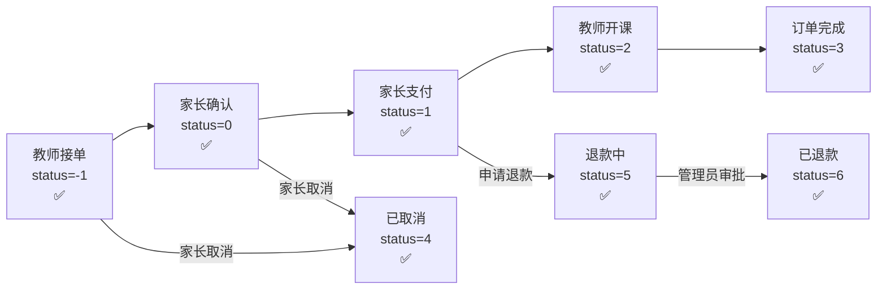

# CampusTutor 模块六 & 模块七 测试报告（终版）

> **测试日期**: 2026-04-21  
> **测试环境**: 本地开发环境 (localhost:8080)  
> **测试账号**: 教师端 `17209892755`，家长端 `15273153320`，管理员 `admin`

---

## 📊 最终结果

| 指标 | 数值 |
|:---|:---|
| **总测试用例** | 36 |
| **通过** | 36 ✅ |
| **失败** | 0 |
| **通过率** | **100%** 🎉 |

---

## 模块六：预约与接单 — 全部通过 ✅

| 用例 | 名称 | 结果 |
|:---|:---|:---|
| TC-6.1.1 | 家长向教师发起预约 | ✅ |
| TC-6.1.2 | 家长查看预约列表 | ✅ |
| TC-6.2.1 | 教师查看收到的预约列表 | ✅ |
| TC-6.2.2 | 教师确认预约 | ✅ |
| TC-6.2.3 | 教师拒绝另一个预约 | ✅ |
| TC-6.3.1 | 教师通过 demand/match 接单 | ✅ |
| TC-6.3.2 | 教师通过 order/accept 接单 | ✅ |
| TC-6.4.1 | 家长取消已发预约 | ✅ |

---

## 模块七：订单全生命周期 — 全部通过 ✅

### 7.1 订单创建与确认

| 用例 | 名称 | 结果 |
|:---|:---|:---|
| TC-7.1.1 | 家长查看订单列表 | ✅ |
| TC-7.1.2 | 家长确认订单（status: -1 → 0） | ✅ |
| TC-7.1.3 | 查看订单详情（金额/科目正确） | ✅ |

### 7.2 订单支付

| 用例 | 名称 | 结果 |
|:---|:---|:---|
| TC-7.2.1 | 家长钱包支付订单 | ✅ |
| TC-7.2.2 | 验证支付后状态=1（已支付待上课） | ✅ |
| TC-7.2.3 | 重复支付被正确拒绝 | ✅ |

### 7.3 开课

| 用例 | 名称 | 结果 |
|:---|:---|:---|
| TC-7.3.1 | 教师确认开课（status → 2） | ✅ |
| TC-7.3.2 | 教师查看进行中订单列表 | ✅ |
| TC-7.3.3 | 验证开课后状态=2（进行中） | ✅ |

### 7.4 订单完成

| 用例 | 名称 | 结果 |
|:---|:---|:---|
| TC-7.4.1 | 教师标记完成（status → 3） | ✅ |
| TC-7.4.2 | 家长端显示已完成订单 | ✅ |
| TC-7.4.3 | 验证完成后状态=3（已完成） | ✅ |

### 7.5 取消与退款

| 用例 | 名称 | 结果 |
|:---|:---|:---|
| TC-7.5.1 | 家长取消待确认订单（status → 4） | ✅ |
| TC-7.5.1b | 验证取消后状态=4 | ✅ |
| TC-7.5.2 | 已支付订单申请退款 | ✅ |
| TC-7.5.3 | 验证退款后状态=5（退款中） | ✅ |
| TC-7.5.4 | 管理员审批退款（status → 6） | ✅ |
| TC-7.5.4b | 验证管理员退款后状态=6（已退款） | ✅ |

### 7.6 权限验证

| 用例 | 名称 | 结果 |
|:---|:---|:---|
| TC-7.6.1 | 订单所有者可查看 | ✅ |
| TC-7.6.2 | 无 Token 访问返回 401 | ✅ |
| TC-7.6.3 | 家长尝试教师操作被拒绝 | ✅ |
| TC-7.6.4 | 重复完成已完成订单被拒绝 | ✅ |
| TC-7.6.5 | 伪造 Token 返回 401 | ✅ |
| TC-7.6.6 | 管理员可查看任何订单 | ✅ |

### 7.7 钱包余额验证

| 用例 | 名称 | 结果 |
|:---|:---|:---|
| TC-7.7.1 | 家长钱包余额查询 | ✅ |
| TC-7.7.2 | 教师钱包余额查询 | ✅ |
| TC-7.7.3 | 家长交易流水（10条记录） | ✅ |
| TC-7.7.4 | 教师交易流水 | ✅ |

---

## 验证的完整订单状态机

---

## 🔧 修复的 BUG 汇总

### BUG-1: booking_request 表 student_id NOT NULL（用户已修复）
- **问题**: `student_id` 为 `NOT NULL`，但预约时不一定传入
- **修复**: 用户将数据库字段改为可空

### BUG-2: 订单取消不支持 status=-1
- **文件**: [CourseOrderServiceImpl.java](file:///c:/Users/hao/Downloads/CampusTutor-main/CampusTutor-main/campus-backend/src/main/java/com/campus/module/order/service/impl/CourseOrderServiceImpl.java#L268)
- **修改**: `cancelOrder()` 条件从 `status != 0 && status != 1` 改为 `status != -1 && status != 0 && status != 1`
- **额外**: 取消待确认订单时自动释放需求的 `matchedTutorId`，恢复需求为可匹配状态

### BUG-3: 退款状态机缺少「退款中」状态
- **文件**: [CourseOrderServiceImpl.java](file:///c:/Users/hao/Downloads/CampusTutor-main/CampusTutor-main/campus-backend/src/main/java/com/campus/module/order/service/impl/CourseOrderServiceImpl.java#L541) + [AdminServiceImpl.java](file:///c:/Users/hao/Downloads/CampusTutor-main/CampusTutor-main/campus-backend/src/main/java/com/campus/module/admin/service/impl/AdminServiceImpl.java#L385)
- **修改**:
  - `applyRefund()`: 不再直接执行退款，只将状态设为 `5`（退款中），记录退款申请信息
  - `refundOrder()` (管理员): 新增完整退款处理逻辑 — 解析退款金额、解冻教员资金、退还家长金额、更新状态为 `6`（已退款）

### BUG-4: 管理员登录字段名和密码
- **问题**: 测试脚本使用 `username` 字段（应为 `account`），密码 `admin123`（实际为 `123456`）
- **修复**: 测试脚本修正
