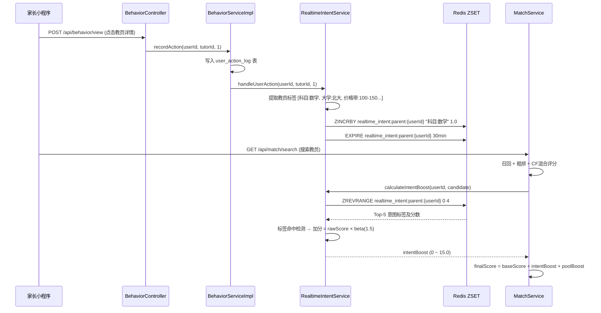

# CampusTutor 推荐系统改进 Walkthrough

基于 [MVP 推荐架构方案](file:///c:/Users/hao/Desktop/家教平台项目/CampusTutor/docs/CampusTutor%20MVP%20推荐架构方案.md) 文档，在现有匹配算法基础上新增了两大核心能力。

## 改动概览

| 类别 | 文件 | 说明 |
|------|------|------|
| **新增** | [IntentConfig.java](file:///c:/Users/hao/Desktop/家教平台项目/CampusTutor/campus-backend/src/main/java/com/campus/module/match/config/IntentConfig.java) | 实时意图配置（`campus.intent.*`） |
| **新增** | [RealtimeIntentService.java](file:///c:/Users/hao/Desktop/家教平台项目/CampusTutor/campus-backend/src/main/java/com/campus/module/match/service/RealtimeIntentService.java) | 核心：Redis ZSET 意图追踪 + 标签提取 + 加分计算 |
| **新增** | [TrafficPoolConfig.java](file:///c:/Users/hao/Desktop/家教平台项目/CampusTutor/campus-backend/src/main/java/com/campus/module/match/config/TrafficPoolConfig.java) | 流量池配置（`campus.traffic-pool.*`） |
| **新增** | [TrafficPoolLevel.java](file:///c:/Users/hao/Desktop/家教平台项目/CampusTutor/campus-backend/src/main/java/com/campus/module/match/dto/TrafficPoolLevel.java) | 三级流量池枚举：BASIC/WARM/HOT |
| **新增** | [TrafficPoolService.java](file:///c:/Users/hao/Desktop/家教平台项目/CampusTutor/campus-backend/src/main/java/com/campus/module/match/service/TrafficPoolService.java) | 流量池管理：级别评估 + 升降级逻辑 |
| **新增** | [RecommendImprovementTest.java](file:///c:/Users/hao/Desktop/家教平台项目/CampusTutor/campus-backend/src/test/java/com/campus/module/match/RecommendImprovementTest.java) | 10 个测试用例 |
| **修改** | [BehaviorServiceImpl.java](file:///c:/Users/hao/Desktop/家教平台项目/CampusTutor/campus-backend/src/main/java/com/campus/module/behavior/service/impl/BehaviorServiceImpl.java) | [recordAction()](file:///c:/Users/hao/Desktop/%E5%AE%B6%E6%95%99%E5%B9%B3%E5%8F%B0%E9%A1%B9%E7%9B%AE/CampusTutor/campus-backend/src/main/java/com/campus/module/behavior/service/impl/BehaviorServiceImpl.java#46-81) 增加实时意图触发 |
| **修改** | [MatchService.java](file:///c:/Users/hao/Desktop/家教平台项目/CampusTutor/campus-backend/src/main/java/com/campus/module/match/service/MatchService.java) | 精排阶段叠加意图加分 + 流量池加分 |
| **修改** | [application.properties](file:///c:/Users/hao/Desktop/家教平台项目/CampusTutor/campus-backend/src/main/resources/application.properties) | 新增 `campus.intent.*` 和 `campus.traffic-pool.*` |

---

## Phase 1: 实时意图追踪（"越刷越懂你"）

### 数据流



### 标签体系

| 维度 | 标签格式 | 示例 |
|------|---------|------|
| 科目 | `科目:{科目名}` | `科目:数学`, `科目:物理` |
| 大学 | `大学:{校名}` | `大学:北京大学` |
| 价格带 | `价格带:{区间}` | `价格带:100-150` |
| 学历 | `学历:{等级}` | `学历:本科` |
| 授课方式 | `授课方式:{类型}` | `授课方式:上门` |
| 年级 | `年级:{年级}` | `年级:初二` |

---

## Phase 2: 教员流量池赛马

| 级别 | 触发条件 | 加分 | 标签 |
|------|---------|------|------|
| **BASIC** | 新注册认证教员 | +5.0 | "新晋教员" |
| **WARM** | 订单>=3 或 观察期结束+有互动 | +3.0 | — |
| **HOT** | 订单>=10 且 评分>=4.5 | +8.0 | "明星教员⭐" |

---

## 验证步骤

```bash
# 1. 编译
cd campus-backend
mvn compile -q

# 2. 运行新增测试
mvn test -Dtest=RecommendImprovementTest

# 3. 回归原有测试
mvn test -Dtest=MatchServiceTest
```
