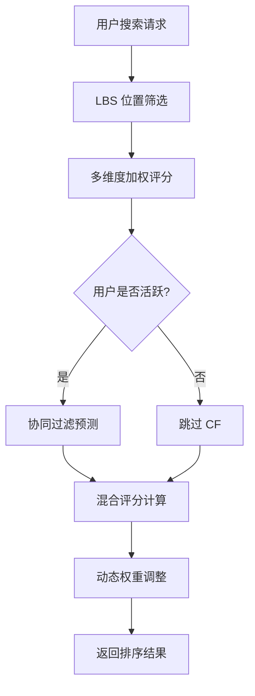
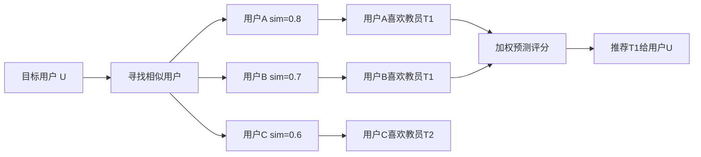

# CampusTutor 智能匹配算法总结

## 1. 算法概述

CampusTutor 平台采用 **混合推荐系统（Hybrid Recommender System）** 架构，结合以下三种核心技术：

1. **多维度加权评分算法（Content-Based Scoring）** - 基于教员属性和需求条件的匹配度计算
2. **基于用户的协同过滤（User-Based Collaborative Filtering）** - 利用相似用户行为进行个性化推荐
3. **动态权重调整（Dynamic Weight Adjustment）** - 根据用户成熟度自适应调整算法权重



---

## 2. 多维度加权评分算法

### 2.1 设计思路

该算法采用 **多属性加权评分模型**，将教员与需求的匹配度分解为多个可量化的维度，每个维度独立计算得分后加权汇总。**所有权重参数均可通过 `application.properties` 配置文件进行调整，无需修改代码。**

### 2.2 家长视角权重配置（找老师）

家长寻找教师时，关注 **教师质量** 和 **性价比**：

| 维度 | 配置项 | 默认权重 | 说明 |
|------|--------|----------|------|
| 科目匹配 | `parent-subject` | 23% | 教师教授科目与需求是否一致 |
| 距离评分 | `parent-distance` | 18% | 教师与家长的地理距离 |
| 年级匹配 | `parent-grade` | 14% | 教师可教年级与学生年级匹配度 |
| 价格匹配 | `parent-price` | 10% | 教师报价是否在预算范围内（越低越好） |
| 教员评分 | `parent-rating` | 10% | 历史订单的用户评价 |
| 教学经验 | `parent-experience` | 10% | 历史订单数量 |
| 学历背景 | `parent-education` | 5% | 博士 > 硕士 > 本科 > 大专 |
| 教学特长 | `parent-specialty` | 5% | 教学风格与学习目标匹配度 |
| 授课方式 | `parent-teach-mode` | 5% | 上门/网课与需求匹配 |

### 2.3 教师视角权重配置（找学生）

教师寻找需求时，关注 **收益** 和 **匹配度**：

| 维度 | 配置项 | 默认权重 | 说明 |
|------|--------|----------|------|
| 科目匹配 | `teacher-subject` | 25% | 需求科目是否在教师可教范围 |
| 价格匹配 | `teacher-price` | 20% | 需求预算越高越好（与家长视角相反）💰 |
| 年级匹配 | `teacher-grade` | 15% | 学生年级是否在可教范围 |
| 距离评分 | `teacher-distance` | 15% | 需求地点的地理距离 |
| 授课方式 | `teacher-teach-mode` | 10% | 上门/网课匹配 |
| 需求新鲜度 | `teacher-freshness` | 10% | 新发布的需求得分更高 🔥 |
| 需求详细度 | `teacher-detail` | 5% | 描述越详细越靠谱 |

### 2.4 核心计算公式

**综合匹配分数计算：**
```
TotalScore = Σ(Dimension_i × Weight_i)  [i = 1 to n]
FinalScore = min(100, TotalScore)
```

**距离评分（线性递减）：**
```java
if (distance >= maxDistanceKm) return 0;
return weightDistance * (1 - distance / maxDistanceKm);
// 默认 maxDistanceKm = 10km
```

**价格评分（家长视角）：**
```java
if (tutorPrice <= budget) return weightPrice; // 满分
if (overRatio >= priceOverRatioMax) return 0; // 超出阈值，0分
return weightPrice * (1 - overRatio / priceOverRatioMax); // 线性递减
```

**价格评分（教师视角 - 反向逻辑）：**
```java
ratio = demandBudget / tutorExpectPrice;
if (ratio >= 1.5) return tWeightPrice; // 预算高于期望50%，满分
if (ratio >= 1.0) return tWeightPrice * (0.8 + 0.2 * (ratio - 1.0) / 0.5);
if (ratio >= 0.8) return tWeightPrice * 0.6;
return tWeightPrice * 0.3; // 远低于期望
```

---

## 3. 基于用户的协同过滤算法（User-Based CF）

### 3.1 设计思路

协同过滤通过分析 **相似用户的行为**，为目标用户推荐他们可能喜欢但尚未接触的教员。核心逻辑是：\"与你相似的家长都选了这位老师，你可能也会喜欢\"。



### 3.2 隐式评分向量构建

将用户的历史行为转换为数值评分：

| 行为类型 | 权重分值 | 说明 |
|----------|----------|------|
| 下单 | 1.0 | 最强正向信号 |
| 聊天 | 0.6 | 明确表达兴趣 |
| 收藏 | 0.4 | 有意向但未行动 |
| 查看详情 | 0.1 | 基础浏览行为 |
| 搜索 | 0.05 | 最弱信号 |

### 3.3 用户相似度计算（余弦相似度）

```java
similarity = dotProduct(A, B) / (||A|| × ||B||)

// 其中：
// dotProduct = Σ(ratingA[i] × ratingB[i]) for 共同教员
// ||A|| = √Σ(ratingA[i]²) for 所有评分
```

### 3.4 评分预测

基于相似用户的加权平均：
```
predictedScore(u, t) = Σ(similarity(u, v) × rating(v, t)) / Σ|similarity(u, v)|
```

### 3.5 冷启动处理

| 用户类型 | 行为数量 | 处理策略 |
|----------|----------|----------|
| 冷启动用户 | < 5 | 禁用 CF，仅用内容匹配 |
| 普通用户 | 5-10 | 开启 CF，权重较低 |
| 活跃用户 | > 10 | 完全开启 CF，权重较高 |

---

## 4. 混合评分策略（Hybrid Scoring）

### 4.1 混合公式

将内容匹配分数与协同过滤预测分数融合：

```
HybridScore = (1 - cfWeight) × ContentScore + cfWeight × CFScore × 100
// 默认 cfWeight = 0.3，即 CF 占 30%
```

### 4.2 推荐标签

根据 CF 预测分数添加用户可见的推荐标签：

| CF分数 | 标签 |
|--------|------|
| ≥ 0.7 | \"相似用户推荐\" ⭐ |
| ≥ 0.5 | \"智能推荐\" |
| < 0.5 | 无标签 |

---

## 5. LBS 位置服务

### 5.1 技术实现

- **存储**：使用 Redis GEO 数据结构存储教员和需求的地理位置
- **查询**：GEORADIUS 命令进行附近范围搜索
- **备用**：Redis 不可用时，使用 Haversine 公式在内存中计算距离

### 5.2 距离计算

```java
// Haversine 公式（地球表面两点间距离）
a = sin²(Δlat/2) + cos(lat1) × cos(lat2) × sin²(Δlon/2)
c = 2 × atan2(√a, √(1-a))
distance = R × c  // R = 6371km（地球半径）
```

---

## 6. 配置参数

### 6.1 协同过滤配置（`campus.cf.*`）

```properties
# 最少共同交互教员数
campus.cf.min-common-items=2
# 相似用户Top-K
campus.cf.top-k-similar-users=20
# CF在混合模型中的权重(0.0~1.0)
campus.cf.cf-weight=0.3
# 最小相似度阈值
campus.cf.min-similarity=0.1
# 冷启动阈值
campus.cf.cold-start-threshold=5
# 缓存过期时间(秒)
campus.cf.cache-expire-seconds=3600
# 是否启用缓存
campus.cf.enable-cache=true
```

---

## 7. 关键代码文件

| 文件 | 路径 | 说明 |
|------|------|------|
| MatchWeightConfig | `campus-backend/.../match/config/` | 匹配权重配置类 |
| MatchScoreCalculator | `campus-backend/.../match/service/` | 多维度评分核心算法 |
| MatchService | `campus-backend/.../match/service/` | 搜索服务主入口 |
| CollaborativeFilteringServiceImpl | `campus-backend/.../match/service/impl/` | 协同过滤实现 |
| DynamicWeightCalculator | `campus-backend/.../match/service/` | 动态权重计算 |
| CFConfig | `campus-backend/.../match/config/` | CF 算法参数配置 |
| GeoService | `campus-backend/.../demand/service/` | LBS 地理位置服务 |

---

## 8. 算法优势

1. **参数可配置**：所有权重参数可通过配置文件调整，无需修改代码
2. **多维度匹配**：9个维度（家长）/ 7个维度（教师）全面评估匹配质量
3. **双视角设计**：家长和教师使用不同的评分逻辑
4. **个性化推荐**：协同过滤利用群体智慧
5. **自适应权重**：根据用户成熟度动态调整
6. **位置感知**：LBS 服务支持就近推荐
7. **冷启动处理**：新用户也能获得合理推荐
8. **缓存优化**：Redis 缓存提升响应速度

---

*文档更新日期：2026-01-13*
